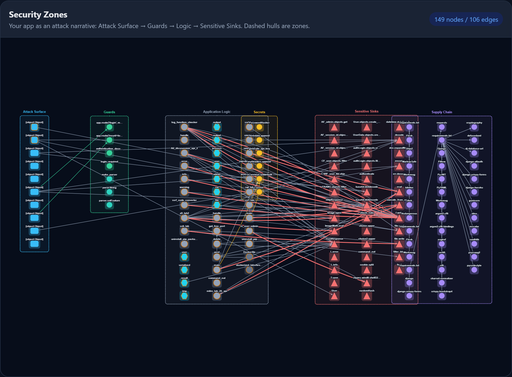
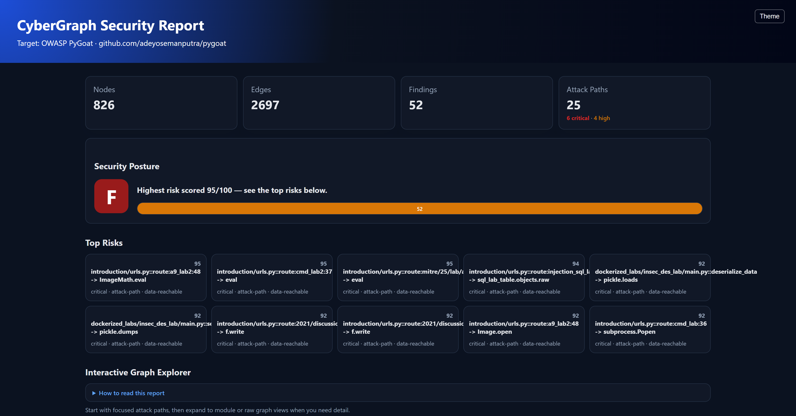
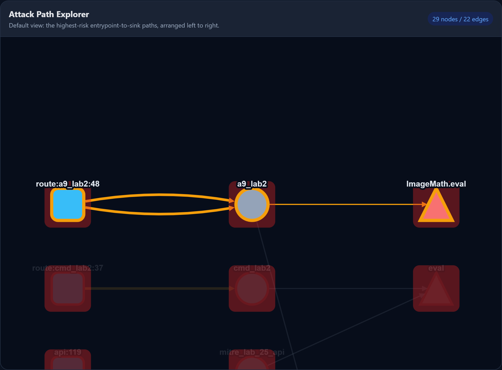

# CyberGraph

## AI writes. CyberGraph verifies.

Your AI coding agent wrote the change. Should the same AI be the only thing that reviews it?

CyberGraph is an **independent, offline security verifier for code changes**. It checks each change against your application's security rules and returns an **ACCEPT** or **REVIEW** verdict with cited evidence — computed deterministically on your machine, with **no cloud upload, no mandatory LLM, and no per-check token cost**.

- **ACCEPT** — the supported checks ran and found nothing.
- **REVIEW** — something changed, or a relevant check couldn't be verified.

It never turns *"didn't look"* into a pass: every capability reports `PASS`, `UNKNOWN`, `NOT_SUPPORTED`, or `NOT_APPLICABLE` explicitly, so a blind spot is visible, not silent. **Uncertainty never becomes safety** — if CyberGraph cannot prove a check passed, it tells you, rather than issue a false ACCEPT.

Install it as a hook and it runs the moment an agent finishes a turn or a commit is made — verification that doesn't depend on the agent choosing to check itself:

```text
AI writes  →  CyberGraph checks  →  ACCEPT / REVIEW  →  shows why (cited evidence)
```

> **No cloud upload · No mandatory LLM · No per-check token cost · No silent blind spots**
> `pip install cybergraph` — zero API keys, zero signup, zero network calls, zero runtime dependencies. Under the hood CyberGraph maps your repository into a cybersecurity knowledge graph (reachability, taint, trust boundaries, construction-provenance) — the engine that makes each verdict precise. An LLM is optional and only rephrases evidence the graph has already grounded; nothing about the analysis or the verdict requires one.

## See it in action

CyberGraph turns a codebase into an interactive security map. Below it is analyzing [OWASP PyGoat](https://github.com/adeyosemanputra/pygoat), a deliberately vulnerable app — **826 nodes, 25 attack paths, no API key**. Everything renders in one self-contained, offline HTML file.

**Security zones — your app as an attack narrative.** Entrypoints flow left-to-right through guards and application logic into sensitive sinks, secrets, and dependencies:



**Guided report — posture grade, top risks, and stats at a glance.** Real reachable vulnerabilities (`eval`, `pickle.loads`, `sql_lab_table.objects.raw`, `subprocess.Popen`) rank at the top, each with an evidence-backed score:



**Attack-path explorer — trace user input to a dangerous sink.** The report opens on the highest-risk path, glowing from route entrypoint to sink:



Generate this for any repo with `cybergraph visualize path/to/repo` (dark theme shown; a light theme and toggle are built in).

## Why this exists

Two problems collide. Security scanners are noisy and flat — a file, a line, a rule, a warning — leaving developers to answer the hard questions themselves:

- Is this issue reachable from production code?
- Is there authentication before this sensitive action?
- Did this pull request affect a security boundary?
- Which scanner findings matter first?

And now AI agents generate code faster than anyone can review it, so those questions arrive on every change — and having the same class of model that wrote the code also review it is nondeterministic, spends tokens on every turn, and doesn't scale.

CyberGraph connects the dots and turns the answer into a **decision** made *independently* of the coding model. It **verifies** each change against the security guarantees it can check and returns a single ACCEPT/REVIEW verdict, and it **monitors** the codebase over time — what regressed, what was fixed, what a change moved across a trust boundary. The security decision is deterministic and local, with **no per-check LLM or API cost** — cheap enough to run on every commit and every agent turn.

## Current capabilities

- Builds a local SQLite graph in `.cybergraph/graph.db`.
- **One-command verdict** — `cybergraph .` detects a pending change, verifies it, and prints a
  *collapsed* verdict: a decision line plus the single most load-bearing reason, worded in
  language **bounded by how well that finding is validated** — "Confirmed" only when the evidence
  is strong *and* the capability is benchmark-backed, otherwise "Possible" or "could not verify."
  On a clean tree it scans the current code and says so, rather than printing a bare ACCEPT on
  un-diffed history.
- **Policy gate for CI** — a declared `[verification]` policy turns a verdict into a
  `block` / `warn` / `info` gate, *without ever changing the verdict itself* (no configuration can
  turn a REVIEW into an ACCEPT); `--fail-on-review` now fails the build only when the gate blocks.
- Analyzes **five languages**: Python (FastAPI/Flask/Django), JavaScript/TypeScript (Express/Next.js), Go (net/http, Gin, Echo), Java (Spring), and C# (ASP.NET Core) — through a shared analyzer contract with graceful fallback for the rest.
- Extracts functions, calls, route entrypoints, auth/authz guards, validators, user-input/data-flow edges, secret access/exposure, cloud resources, and sensitive sink calls.
- **Config posture** — open Firebase security rules, Supabase tables with row-level
  security off, and public S3/GCS bucket policies. A change that weakens one is a REVIEW.
- **CORS & client secrets** — a CORS policy allowing any origin *with credentials*
  (FastAPI / Express), and secrets shipped to the browser via `NEXT_PUBLIC_`. A change
  that introduces either is a REVIEW.
- **JS/TS SQL/command/code/path verdicts** — Express/Node sink arguments are graded SAFE/UNSAFE/UNKNOWN
  from construction provenance (literal vs. tainted-variable vs. unresolved), not just inventoried.
  Go now earns the same treatment for its SQL/command/path sinks (`database/sql`, `os/exec`,
  `os`/`io/ioutil`), fail-safe on anything a Go parser would be needed to read.
- **Java SQL/command/path/deserialization verdicts** — Spring/JDBC sink arguments (`Statement`/
  `prepareStatement`, `Runtime.exec`/`ProcessBuilder`, `File`/path constructors) are graded
  SAFE/UNSAFE/UNKNOWN from construction provenance the same way, and native deserialization
  (`ObjectInputStream.readObject`/`readUnshared`) is never SAFE, not just inventoried.
- **C# SQL/command/path/deserialization/code-execution verdicts** — ASP.NET Core/ADO.NET sink
  arguments (`SqlCommand`/`ExecuteReader`, `Process.Start`/`ProcessStartInfo`, `StreamReader`/
  `FileStream`/path constructors, `CSharpScript.EvaluateAsync`) are graded SAFE/UNSAFE/UNKNOWN
  from construction provenance the same way — including C# string interpolation
  (`$"...{expr}..."`) — and native deserialization (`BinaryFormatter.Deserialize`) is never
  SAFE, not just inventoried.
- **Cross-file, interprocedural attack paths** (route → service → repository → sink) with confidence, sanitizer-barrier flags, taint/data-reachability, risk scores, and fix guidance; a `--shallow` mode reproduces intra-function traversal for comparison.
- **Interactive, offline HTML report** built for first-time readers: a dark-mode-first neon graph explorer (glowing, security-typed nodes with a light/dark toggle), NODE/EDGE/ZONE explainer cards, a guided first view that opens on the top attack path with a plain-language narrative, a security-zones view (Attack Surface → Guards → Logic → Sensitive Sinks), search, layer/severity filters, a details panel with source drill-down, and entrypoint→sink path highlighting (Cytoscape.js, fully inlined).
- **Exec-first report posture**: an A–F security grade with a one-line verdict and severity-distribution bar, a since-last-scan delta strip (new/regressed/fixed), findings grouped into expandable rule cards, an honest findings-cap footer, and a print stylesheet for clean PDF export.
- **Evidence-grounded answers** (`cybergraph explain`) with file/line/rule/path citations, attack-path narratives, remediation guidance, and a high/medium/low/insufficient confidence level — never claims a vulnerability without supporting evidence, and works with no LLM.
- Optional, **local-only by default** LLM phrasing via configurable providers (Anthropic Claude, OpenAI, Kimi 2.6) constrained to retrieved evidence.
- Maps dependency manifests and lockfiles across npm, Python, Go, Maven/Gradle, and .NET ecosystems.
- Imports OSV Scanner, npm audit, Semgrep JSON, SARIF, and Gitleaks reports into the same graph; enriches vulnerabilities from offline EPSS/KEV/CVSS/advisory JSON; exports findings as SARIF.
- Correlates Terraform resources to application code references so public cloud exposure can be connected to reachable routes, sinks, and dependency risk.
- Exposes MCP tools for AI coding assistants.

## Install

```bash
# From PyPI (once published):
pipx install cybergraph                 # isolated CLI install
python -m pip install cybergraph        # or into the current environment

# Optional extras:
python -m pip install "cybergraph[mcp]" # MCP server for AI assistants
python -m pip install "cybergraph[llm]" # Anthropic / OpenAI / Kimi providers
python -m pip install "cybergraph[all]" # everything optional

# From a clone (development):
python -m pip install -e ".[dev]"
```

Supported Python: 3.10, 3.11, 3.12, 3.13.

## Quick start

```bash
cybergraph quickstart .        # zero-to-report: init, build, analyze, open report
cybergraph .                   # one command: verify a pending change, or scan the current code if there's none
cybergraph init .
cybergraph doctor .
cybergraph check .            # does this change preserve the guarantees CyberGraph can verify?
cybergraph policy --repo .    # show the declared security policy and what it protects
cybergraph analyze .          # build + run every analysis, print top risks
cybergraph history .          # what's new / fixed / regressed since the last scan
cybergraph config show .      # inspect effective config + LLM/graph state
cybergraph build path/to/repo
cybergraph ask "Which functions reach SQL execution?" --repo path/to/repo
cybergraph explain "Which routes reach SQL execution?" --repo path/to/repo
cybergraph paths --repo path/to/repo
cybergraph layers --repo path/to/repo
cybergraph secrets path/to/repo
cybergraph cloud-code path/to/repo
cybergraph top-risks path/to/repo
cybergraph scan path/to/repo               # lightweight built-in analyzers, no graph needed
cybergraph triage path/to/repo             # rank findings; --llm suppresses false positives
cybergraph sca path/to/repo                # prioritize dependency CVEs by reachability
cybergraph infer-specs path/to/repo        # propose custom taint sinks/sources
cybergraph iac-paths path/to/repo          # public exposure -> privileged IaC resource
cybergraph investigate path/to/repo --output investigation.md
cybergraph strix-plan path/to/repo --output strix-plan.md
cybergraph import-strix strix_runs/<run> --repo path/to/repo
cybergraph export-json path/to/repo --output graph.json
cybergraph opengraph path/to/repo --output opengraph.json   # BloodHound OpenGraph interop
cybergraph review --base main --repo path/to/repo
cybergraph pr-comment --base main --repo path/to/repo --output cybergraph-pr-comment.md
cybergraph visualize path/to/repo
cybergraph sarif --repo path/to/repo --output cybergraph.sarif
```

Typical build output:

```text
Built security graph for examples/vulnerable-fastapi
Nodes: 15 | Edges: 28 | Findings: 1
```

Typical PR comment — projected from the canonical verdict, so it leads with the decision, the
single primary reason in trust-bounded language, and the policy gate, then keeps the "what
changed" delta below:

```text
## CyberGraph Security Review
Decision: REVIEW
Confirmed: Unsafe database queries: `execute` sends this value to the database as part of a query
_1 more item surfaced by this check — run `cybergraph check --json` for the full list._
Gate: block

### What Changed
CyberGraph detected 1 changed file, 1 entrypoint, 1 sensitive sink edge, 1 finding in changed files, 1 worsened reachable risk.
```

Import scanner results:

```bash
cybergraph import-report semgrep.json --repo path/to/repo
cybergraph import-vulns osv-results.json --repo path/to/repo
cybergraph enrich-vulns advisory-intel.json --repo path/to/repo
cybergraph ask "Which high severity findings involve secrets?" --repo path/to/repo
```

Validate reachable risk with an AI pentester ([Strix](https://github.com/usestrix/strix)):

```bash
# 1. Turn CyberGraph's reachable paths into a focused Strix scope brief
cybergraph strix-plan path/to/repo --output strix-plan.md

# 2. Run Strix yourself against that brief (needs Docker + an LLM key):
#      strix -n -t path/to/repo -m quick --instruction-file strix-plan.md
#    ...or let CyberGraph orchestrate it end-to-end (optional, opt-in):
cybergraph strix-run path/to/repo --scan-mode quick

# 3. Import Strix's PoC-validated findings back into the graph
cybergraph import-strix strix_runs/<run-name> --repo path/to/repo
cybergraph top-risks path/to/repo   # validated findings rank at the top
```

CyberGraph tells Strix *where* to attack (reachable routes and sinks), and Strix
tells CyberGraph *what is actually exploitable* (validated with a working PoC).
Strix is never a dependency — the `strix-run` bridge only activates when the
`strix` binary and Docker are both present, so the offline-by-default workflow is
unchanged.

Suppress accepted findings:

```python
def test_fixture(name):
    # cybergraph: ignore CG-SQL-EXEC accepted test-only query
    return db.execute("select * from users where name = '" + name + "'")
```

Or configure repository-level suppressions:

```toml
[suppressions]
rules = ["CG-SQL-EXEC"]
paths = ["legacy/**"]
```

Naming a rule also covers the `-UNVERIFIED` variant CyberGraph reports when it can see a value reach a sink but cannot confirm how the value was built — accepting `CG-SQL-EXEC` accepts `CG-SQL-EXEC-UNVERIFIED` on the same line or in the same repository. The reverse is deliberately not true: naming `CG-SQL-EXEC-UNVERIFIED` accepts only the unconfirmed case, and a confirmed `CG-SQL-EXEC` is still reported.

Suppressions hide findings, but the graph still keeps edges such as `REACHES_SINK` so reviewers can inspect the real code path.

**New:** `paths` now also hides matching entrypoint-to-sink *attack paths* from the ranked, actionable surfaces — `cybergraph attack-paths`, top risks, `analyze`, the PR review, the cloud and Strix scopes. Attack paths were previously never suppressed anywhere, so this is a change in what those commands print. A path is hidden only when **every** file it touches is suppressed, so a route crossing from suppressed code into live code is still reported. The exploration and evidence surfaces still show suppressed paths — the JSON graph export (which records the policy under its `suppression` key), the HTML report, the MCP `explain_attack_path_tool`, grounded answers, and LLM triage slices — and a suppressed path never consumes a slot a real one needs on any of them. Each surface caps how many paths it traverses; suppressed paths are collected separately and fill only what the real ones leave, so accepted fixture noise cannot push the genuine attack paths off the end of the report, the exported graph or the evidence an LLM is grounded on. A PR review scans both sides of the diff under the *current* configuration — `[suppressions] paths`, `[ignore] paths` and `[security] sinks` alike — so changing any of them can never appear as an added or removed attack path. It is reported as a configuration change instead, alongside a count of the reachable risks the suppressions hide (hidden, not fixed) and the changed files `[ignore] paths` kept out of the analysis entirely (not analysed, not fixed). A PR that genuinely removes a vulnerable line is still reported as `removed`, and one that genuinely introduces a sink is still reported as `added`. Scan history holds the same line: a finding that disappears because `[suppressions] rules`, `[suppressions] paths` or `[ignore] paths` now covers it is counted as *hidden by config (hidden, not fixed)* rather than as fixed, on `cybergraph history`, on the `analyze` delta line and in the HTML report's delta strip. Its history row stays open, so dropping the suppression later reads as persisting rather than as a regression. A finding that disappears because the code changed is still fixed.

## Security policy

**Phase 1 contract — the sentence this work is judged against:**

> Given a supported AI-generated code change, CyberGraph can tell whether the specific security guarantees it understands were preserved — and explicitly admit what it could not verify.

`cybergraph check` is the command that evaluates a change against that contract. It compares
the current state of a repository against a base ref (`--mode merge-base|worktree|range`) and
reports one of two states: `accept` (the checks that ran found nothing) or `review` (something
needs a human look) — plus `not_evaluated`, an explicit list of what CyberGraph could not
check on this change. It never turns "did not look" into a pass; a capability only passes when
there is positive evidence it was analyzed. `--json` emits the same structure a script or CI
step can consume; the CI workflow (`.github/workflows/cybergraph.yml`) runs it on every pull
request as a non-gating notification (no `--fail-on-review`) until the field false-positive
rate is measured.

**Enforcement is a separate layer from the verdict.** The verdict says what CyberGraph found;
an optional `[verification]` policy in `cybergraph.policy.toml` decides what CI does about it,
producing a `block` / `warn` / `info` **gate**. By design the gate never rewrites the verdict —
no policy setting can turn a REVIEW into an ACCEPT — it only sets whether the build should stop.
Defaults block a confirmed regression and an unknown on a protected route, and treat a general
"couldn't fully verify" review as advisory. Because of this, `cybergraph check --fail-on-review`
now exits non-zero **only when the gate blocks**, not on every REVIEW; a change that is a REVIEW
purely because something couldn't be evaluated no longer fails the build unless you ask it to.

`cybergraph check` verifies against a declared **security policy** — the routes/functions that
are expected to require authentication, ownership checks, or other guards. Bootstrap one from
what the codebase already does:

```bash
cybergraph check . --init-policy   # writes cybergraph.policy.toml from routes that already require login
```

Review every line of the generated `cybergraph.policy.toml`, edit it to reflect intent (not
just current behaviour), and **commit it to the repository** — it is the baseline `check`
diffs future changes against, so a change that silently drops a guard the policy declares is
what turns an `accept` into a `review`. Because it is a plain committed TOML file, any human or
any agent working in the repository can read it directly to know what CyberGraph expects to be
protected, without running the tool first:

```bash
cybergraph policy --repo .            # show the declared policy and which entities it protects
cybergraph policy --repo . --baseline # print a proposed baseline without writing anything
```

**Language coverage — and how far each is validated.** CyberGraph runs five-language security
analysis, but assurance is not yet uniform across them, and it says so rather than implying
parity:

| Language | Injection verdicts | Validation |
|---|---|---|
| Python | SQL · command · path · code-exec · deserialization · template | **Labelled precision/recall/abstention benchmark ✓** |
| JavaScript / TypeScript | SQL · command · code-exec · path | Beta |
| Go | SQL · command · path | Beta |
| Java | SQL · command · path · deserialization | Beta |
| C# | SQL · command · path · deserialization · code-exec | Beta |

Python currently carries the strongest validated coverage: it is the language held to a labelled
benchmark (`benchmark/run_precision.py`) that gates every change. The other four grade a sink's
argument the same way — **SAFE / UNSAFE / UNKNOWN** from how the value was constructed and
intra-function taint, never a bare keyword match — and are **Beta** until each earns its own
labelled benchmark. Whole-file source-analysis support (`source_analysis_support`) is Python-only
by design; the others are structural, line-based classifiers, so they stay `NOT_SUPPORTED` at
that capability level even while their injection verdicts are graded. Any sink class not yet
upgraded stays **inventory-grade** — a `*-SINK-CALL` map of where sensitive calls live, not a
verdict — and is filtered from code-scanning uploads until it graduates; graded verdict rules are
never filtered.

The cardinal rule is the same in every language: **only an all-literal / constant construction
can read SAFE.** A value built from a variable is UNSAFE when taint confirms it and UNKNOWN
otherwise; native deserialization is never SAFE. **Uncertainty never becomes safety** — the tool
abstains (`-UNVERIFIED`, which drives REVIEW) rather than issue a false ACCEPT.

### Run the check automatically — `cybergraph hook`

`cybergraph check` verifies a change, but something has to invoke it. Install a hook so it
runs on its own at the moment code is accepted:

```bash
cybergraph hook install claude-code   # runs when an agent turn ends (Stop hook)
cybergraph hook install pre-commit     # runs before each commit (the staged index)
cybergraph hook status                 # what's installed
cybergraph hook uninstall pre-commit
```

By default a REVIEW is **surfaced, not blocking** — the commit proceeds and the agent
continues. Install with `--strict` to make a REVIEW block (a non-zero pre-commit exit, or a
Claude Code stop-block the agent must resolve). Installing over a pre-commit hook you already
have is refused unless you pass `--force` (which backs the old hook up first).

## Example questions

```text
Which endpoints can reach SQL execution?
What changed in this PR that affects authentication?
Where are secrets loaded and passed into network clients?
Which vulnerable dependency is reachable from production code?
Are there route handlers that reach shell or file writes?
```

## Try the demo

```bash
cybergraph build examples/vulnerable-fastapi
cybergraph ask "Which routes reach SQL execution?" --repo examples/vulnerable-fastapi
cybergraph visualize examples/vulnerable-fastapi --output cybergraph-report.html
```

## MCP tools

Install with the optional MCP extra and run the server:

```bash
python -m pip install -e ".[mcp]"
cybergraph-mcp
```

Available tools:

- `build_security_graph_tool`
- `query_security_graph_tool`
- `explain_attack_path_tool`
- `grounded_security_answer_tool` (cited, confidence-scored, local-only)
- `analyze_repo_tool` (build + full analysis in one call)
- `top_risks_tool`
- `secret_exposures_tool`
- `prioritize_dependencies_tool` (reachability-ranked SCA)
- `iac_attack_paths_tool`
- `import_scanner_report_tool`
- `import_vulnerabilities_tool`
- `check_change_tool` (mirrors `cybergraph check --json`: `accept`/`review` plus `not_evaluated`)

The MCP surface is an **interoperability surface, not automatic verification**: nothing forces
a connected agent to call `check_change_tool` before or after making a change, and an agent may
decline to call it entirely. For reliable, always-invoked checking, install a client-side hook
(`cybergraph hook install claude-code|pre-commit`, above) so the verdict fires on every agent
turn or commit regardless of whether the agent opts in. Treat these MCP tools as context an
agent can pull, and the hook as the gate it cannot skip.

## Project direction

CyberGraph is intentionally security-first. It is not trying to be a general code graph with security keywords sprinkled on top. The goal is to model controls, attack paths, trust boundaries, scanner findings, and code evidence as one graph.

See:

- [Features & capabilities](docs/features.md) — the detailed reference to everything CyberGraph does
- [Architecture](docs/architecture.md)
- [Getting started](docs/getting-started.md)
- [Five-minute tutorial](docs/tutorial.md)
- [Security ontology](docs/security-ontology.md)
- [Product plan](docs/product-plan.md)
- [GitHub Action](docs/github-action.md)

## Status

Beta. CyberGraph analyzes five languages, builds interprocedural attack paths, imports and enriches scanner findings, correlates IaC to code, ships an interactive HTML report, and exposes an MCP surface for AI assistants. The graph store, analyzers, evidence retrieval, and report are stable; the public API and finding rules may still change before 1.0.
